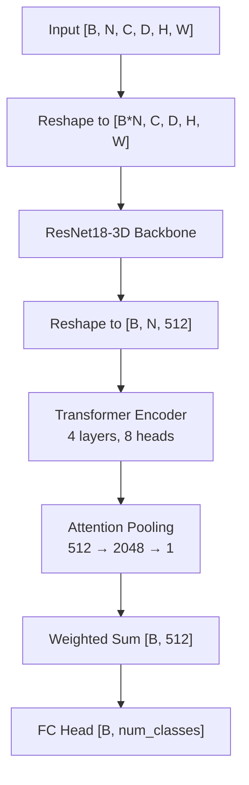

<p align="center">
  
</p>

<p align="center">
  <a href="https://github.com/anirudhbalaraman/WSAttention-Prostate/actions"></a>
  
  
  
  
  <a href="https://github.com/astral-sh/ruff">
  
  </a>
</p>

# Weakly Supervised Attention-Based Deep Learning for Prostate Cancer Characterization from Bi-Parametric Prostate MRI.
Predicts PI-RADS score and risk of clinically significant prostate cancer (csPCa) from T2-Weighted (T2W), Diffusion Weighted Imaging (DWI) and Apparent Diffusion Coefficient (ADC) sequences of bi-paramteric MRI (bpMRI).

## 🚀 Platform Access
Real-time inference via [GUI](https://huggingface.co/spaces/anirudh0410/Prostate-Inference)

## ⭐ Abstract

Deep learning methods used in medical AI—particularly for csPCa prediction and PI-RADS classification—typically rely on expert-annotated labels for training, which limits scalability to larger datasets and broader clinical adoption. To address this, we employ a two-stage multiple-instance learning (MIL) framework pretrained on scan-level PI-RADS annotations with attention-based weak supervision, guided by weak attention heatmaps automatically derived from ADC and DWI sequences. For downstream risk assessment, the PI-RADS classification head is replaced and fine-tuned on a substantially smaller dataset to predict csPCa risk. Careful preprocessing is applied to mitigate variability arising from cross-site MRI acquisition differences. For further details, please refer to our paper or visit the project website.

## Key Features

- ⚡ **Automatic Attention Heatmaps** - Weak attention heatmaps generated automatically from DWI and ADC sequnces.
- 🧠 **Weakly-Supervised Attention** — Heatmap-guided patch sampling and cosine-similarity attention loss, replace the need for voxel-level labels.
- 🧩 **3D Multiple Instance Learning** — Extracts volumetric patches from bpMRI scans and aggregates them via transformer + attention pooling.
- 👁️ **Two-stage pipeline** — Visualise salient patches highlighting probable tumour regions.
- 🧹 **Preprocessing** — Preprocessing to minimize inter-center MRI acquisiton variability.
- 🏥 **End-to-end Pipeline** — Open source, clinically viable complete pipeline. 


## 🚀 Quick Start
1. Clone and Setup
```bash
git clone https://github.com/anirudhbalaraman/WSAttention-Prostate.git
cd WSAttention-Prostate
pip install -r requirements.txt
pytest tests/
```
2. Model Download

```bash
mkdir -p ./models
curl -L -o models/file1.pth https://huggingface.co/anirudh0410/WSAttention-Prostate/resolve/main/cspca_model.pth
curl -L -o models/file2.pth https://huggingface.co/anirudh0410/WSAttention-Prostate/resolve/main/pirads.pt
curl -L -o models/file3.pth https://huggingface.co/anirudh0410/WSAttention-Prostate/resolve/main/prostate_segmentation_model.pt
```

## 🚀 Usage

### Preprocessing

```bash
python preprocess_main.py --config config/config_preprocess.yaml \
    --steps register_and_crop get_segmentation_mask histogram_match get_heatmap
```

### PI-RADS Training

```bash
python run_pirads.py --mode train --config config/config_pirads_train.yaml
```

### csPCa Training

```bash
python run_cspca.py --mode train --config config/config_cspca_train.yaml
```

### Inference

```bash
python run_pirads.py --mode test --config config/config_pirads_test.yaml --checkpoint <path>
python run_cspca.py --mode test --config config/config_cspca_test.yaml --checkpoint_cspca <path>
python run_inference.py --config config/config_preprocess.yaml
```

See the [full documentation](https://anirudhbalaraman.github.io/WSAttention-Prostate/) for detailed configuration options and data format requirements.

## Project Structure

```
WSAttention-Prostate/
├── run_pirads.py              # PI-RADS training/testing entry point
├── run_cspca.py               # csPCa training/testing entry point
├── run_inference.py           # Full inference pipeline
├── preprocess_main.py         # Preprocessing entry point
├── config/                    # YAML configuration files
├── src/
│   ├── model/
│   │   ├── MIL.py             # MILModel_3D — core MIL architecture
│   │   └── csPCa_model.py     # csPCa_Model + SimpleNN head
│   ├── data/
│   │   ├── data_loader.py     # MONAI data pipeline
│   │   └── custom_transforms.py
│   ├── train/
│   │   ├── train_pirads.py    # PI-RADS training loop
│   │   └── train_cspca.py     # csPCa training loop
│   ├── preprocessing/         # Registration, segmentation, heatmaps
│   └── utils.py               # Shared utilities and step validation
├── tests/
├── dataset/                   # Reference images for histogram matching
└── models/                    # Downloaded checkpoints (not in repo)
```

## Architecture

Input MRI patches are processed independently through a 3D ResNet18 backbone, then aggregated via a transformer encoder and attention pooling:



For csPCa prediction, the backbone is frozen and a 3-layer MLP (`512 → 256 → 128 → 1`) replaces the classification head.

