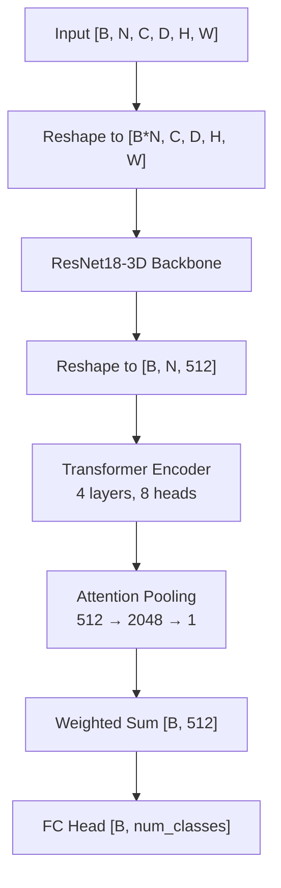

<p align="center">
  
</p>

<p align="center">
  
  
  
  
  <a href="https://anirudhbalaraman.github.io/WSAttention-Prostate/"></a>
</p>

# WSAttention-Prostate

**Weakly-supervised attention-based 3D Multiple Instance Learning for prostate cancer risk prediction on multiparametric MRI.**

WSAttention-Prostate is a two-stage deep learning pipeline that predicts clinically significant prostate cancer (csPCa) risk from T2-weighted, DWI, and ADC MRI sequences. It uses 3D patch-based Multiple Instance Learning with transformer attention to first classify PI-RADS scores, then predict csPCa risk — all without requiring lesion-level annotations.

## Key Features

- **Weakly-supervised attention** — Heatmap-guided patch sampling and cosine-similarity attention loss replace the need for voxel-level labels
- **3D Multiple Instance Learning** — Extracts volumetric patches from MRI scans and aggregates them via transformer + attention pooling
- **Two-stage pipeline** — Stage 1 trains a 4-class PI-RADS classifier; Stage 2 freezes its backbone and trains a binary csPCa head
- **Multi-seed confidence intervals** — Runs 20 random seeds and reports 95% CI on AUC, sensitivity, and specificity
- **End-to-end preprocessing** — Registration, segmentation, histogram matching, and heatmap generation in a single configurable pipeline

## Pipeline Overview


## Quick Start

```bash
git clone https://github.com/anirudhbalaraman/WSAttention-Prostate.git
cd WSAttention-Prostate
pip install -r requirements.txt
pytest tests/
```

## Usage

### Preprocessing

```bash
python preprocess_main.py --config config/config_preprocess.yaml \
    --steps register_and_crop get_segmentation_mask histogram_match get_heatmap
```

### PI-RADS Training

```bash
python run_pirads.py --mode train --config config/config_pirads_train.yaml
```

### csPCa Training

```bash
python run_cspca.py --mode train --config config/config_cspca_train.yaml
```

### Inference

```bash
python run_pirads.py --mode test --config config/config_pirads_test.yaml --checkpoint <path>
python run_cspca.py --mode test --config config/config_cspca_test.yaml --checkpoint_cspca <path>
python run_inference.py --config config/config_preprocess.yaml
```

See the [full documentation](https://anirudhbalaraman.github.io/WSAttention-Prostate/) for detailed configuration options and data format requirements.

## Project Structure

```
WSAttention-Prostate/
├── run_pirads.py              # PI-RADS training/testing entry point
├── run_cspca.py               # csPCa training/testing entry point
├── run_inference.py           # Full inference pipeline
├── preprocess_main.py         # Preprocessing entry point
├── config/                    # YAML configuration files
├── src/
│   ├── model/
│   │   ├── MIL.py             # MILModel_3D — core MIL architecture
│   │   └── csPCa_model.py     # csPCa_Model + SimpleNN head
│   ├── data/
│   │   ├── data_loader.py     # MONAI data pipeline
│   │   └── custom_transforms.py
│   ├── train/
│   │   ├── train_pirads.py    # PI-RADS training loop
│   │   └── train_cspca.py     # csPCa training loop
│   ├── preprocessing/         # Registration, segmentation, heatmaps
│   └── utils.py               # Shared utilities and step validation
├── tests/
├── dataset/                   # Reference images for histogram matching
└── models/                    # Downloaded checkpoints (not in repo)
```

## Architecture

Input MRI patches are processed independently through a 3D ResNet18 backbone, then aggregated via a transformer encoder and attention pooling:



For csPCa prediction, the backbone is frozen and a 3-layer MLP (`512 → 256 → 128 → 1`) replaces the classification head.

