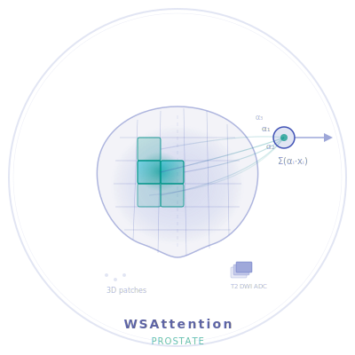

<p align="center">
  
</p>

<p align="center">
  <a href="https://huggingface.co/spaces/anirudh0410/Prostate-Inference">
    
  </a>
<a href="https://github.com/anirudhbalaraman/WSAttention-Prostate/actions/workflows/ci.yaml">
    
  </a>
  
    
  
  
</p>

# Weakly Supervised Attention-Based Deep Learning for Prostate Cancer Characterization from Bi-Parametric Prostate MRI.
Predicts PI-RADS score and risk of clinically significant prostate cancer (csPCa) from T2-Weighted (T2W), Diffusion Weighted Imaging (DWI) and Apparent Diffusion Coefficient (ADC) sequences of bi-paramteric MRI (bpMRI).

## 🚀 Platform Access
Real-time inference via [GUI](https://huggingface.co/spaces/anirudh0410/Prostate-Inference)

## ⭐ Abstract

Deep learning methods used in medical AI—particularly for csPCa prediction and PI-RADS classification—typically rely on expert-annotated labels for training, which limits scalability to larger datasets and broader clinical adoption. To address this, we employ a two-stage multiple-instance learning (MIL) framework pretrained on scan-level PI-RADS annotations with attention-based weak supervision, guided by weak attention heatmaps automatically derived from ADC and DWI sequences. For downstream risk assessment, the PI-RADS classification head is replaced and fine-tuned on a substantially smaller dataset to predict csPCa risk. Careful preprocessing is applied to mitigate variability arising from cross-site MRI acquisition differences. For further details, please refer to our paper or visit the project website.

## Key Features

- ⚡ **Automatic Attention Heatmaps** - Weak attention heatmaps generated automatically from DWI and ADC sequnces.
- 🧠 **Weakly-Supervised Attention** — Heatmap-guided patch sampling and cosine-similarity attention loss, replace the need for voxel-level labels.
- 🧩 **3D Multiple Instance Learning** — Extracts volumetric patches from bpMRI scans and aggregates them via transformer + attention pooling.
- 👁️ **Explainable** — Visualise salient patches highlighting probable tumour regions.
- 🧹 **Preprocessing** — Preprocessing to minimize inter-center MRI acquisiton variability.
- 🏥 **End-to-end Pipeline** — Open source, clinically viable complete pipeline. 


## 🚀 Quick Start
### 1. Clone and Setup
```bash
git clone https://github.com/anirudhbalaraman/WSAttention-Prostate.git
cd WSAttention-Prostate
pip install -r requirements.txt
pytest tests/
```
### 2. Model Download

```bash
mkdir -p ./models
curl -L -o models/file1.pth https://huggingface.co/anirudh0410/WSAttention-Prostate/resolve/main/cspca_model.pth
curl -L -o models/file2.pth https://huggingface.co/anirudh0410/WSAttention-Prostate/resolve/main/pirads.pt
curl -L -o models/file3.pth https://huggingface.co/anirudh0410/WSAttention-Prostate/resolve/main/prostate_segmentation_model.pt
```

## 🚀 Usage
### 🩺 Inference
```bash
python run_inference.py --config config/config_preprocess.yaml
```

Run run_inference.py to execute the full pipeline, from preprocessing to model predictions. 
- 📂 **Input arguments:**
  -  *t2_dir, dwi_dir, adc_dir*: Path to T2W, DWI and ADC sequnces respectively.
  -  *output_dir*: Path to store preprocessed files and results.
 
  ⚠️ ***NOTE: For each scan, all sequences should share the same filename, and the input files must be in NRRD format.***

- 📊 **Outputs:**
  The following are stored for each scan:
  -  Risk of csPCa.
  -  PI-RADS score.
  -  Coordinaates of top 5 salient patches. 
The results are stored in `results.json` saved in output_dir along with the intermediary files from pre processing including the prostate segmentation mask. The patches can be visualised using `visualisation.ipynb`


### 🧹 Preprocessing

Execute preprocess_main.py to preprocess your MRI files.
⚠️ ***NOTE: For each scan, all sequences should share the same filename, and the input files must be in NRRD format.***
```bash
python preprocess_main.py \
  --steps register_and_crop get_segmentation_mask histogram_match get_heatmap \
  --config config/config_preprocess.yaml
```


### ⚙️ PI-RADS ans csPCa Model Training
- **Input Arguments:**
  - *dataset_json*: File paths of the scans. JSON used for training: `dataset/PI-RADS_data.json`.
  - *data_root*: Root direcotry of T2W files.
  - *tile_count*: No. of patches per scan.
  - *tile_size*: Length and width of each patch.
  - *depth*: Depth of each 3D patch

⚠️ ***NOTE: run_cspca.py in train mode requires PI-RADS MIL backbone.***

```bash
python run_pirads.py --mode train --config config/config_pirads_train.yaml
python run_cspca.py --mode train --config config/config_cspca_train.yaml
```

### 📊 Testing

```bash
python run_pirads.py --mode test --config config/config_pirads_test.yaml
python run_cspca.py --mode test --config config/config_cspca_test.yaml
```

See the [full documentation](https://anirudhbalaraman.github.io/WSAttention-Prostate/) for detailed configuration options and data format requirements.

## Project Structure

```
WSAttention-Prostate/
├── run_pirads.py                # PI-RADS training/testing entry point
├── run_cspca.py                 # csPCa training/testing entry point
├── run_inference.py             # Full inference pipeline
├── preprocess_main.py           # Preprocessing entry point
├── config/                      # YAML configuration files
├── src/
│   ├── model/
│   │   ├── MIL.py               # MILModel_3D — core MIL architecture, PI-RADS model
│   │   └── csPCa_model.py       # csPCa_Model
│   ├── data/
│   │   ├── data_loader.py       # MONAI data pipeline
│   │   └── custom_transforms.py # Custom MONAI transforms 
│   ├── train/
│   │   ├── train_pirads.py      # PI-RADS training loop
│   │   └── train_cspca.py       # csPCa training loop
│   ├── preprocessing/           # Registration, segmentation, histogram matching, heatmaps
│   └── utils.py                 # Shared utilities
├── tests/
├── dataset/                     # Reference images for histogram matching
└── models/                      # Downloaded checkpoints (not in repo)
```

## 🙏 Acknowledgement
This work was in large parts funded by the Wilhelm Sander Foundation. Funded by the European Union. Views and opinions expressed are however those of the author(s) only and do not necessarily reflect those of the European Union or European Health and Digital Executive Agency (HADEA). Neither the European Union nor the granting authority can be held responsible for them. 


