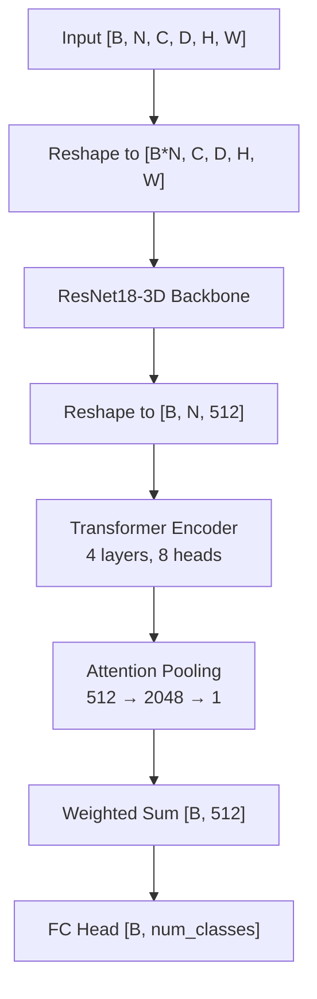
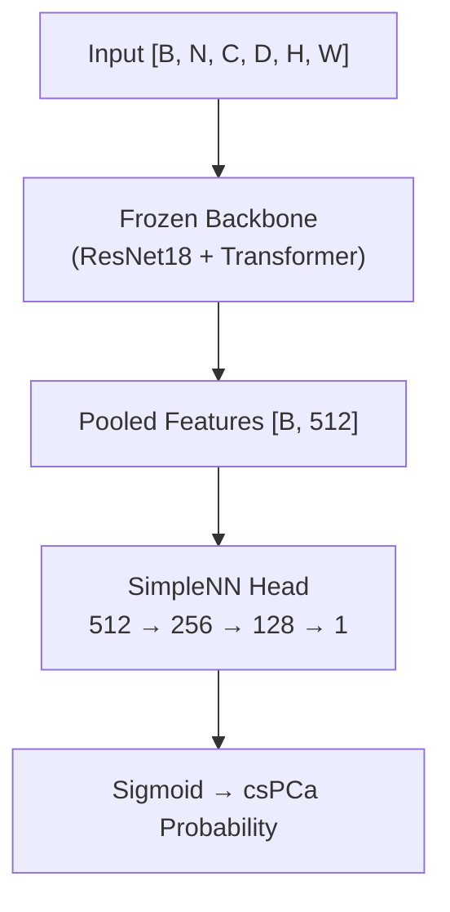

# Architecture

## Tensor Shape Convention

Throughout the pipeline, tensors follow the shape `[B, N, C, D, H, W]`:

| Dim | Meaning | Typical Value |
|-----|---------|---------------|
| B | Batch size | 4–8 |
| N | Number of patches (instances) | 24 |
| C | Channels (T2 + DWI + ADC) | 3 |
| D | Depth (slices per patch) | 3 |
| H | Patch height | 64 |
| W | Patch width | 64 |

## MILModel_3D

The core model processes each patch independently through a CNN backbone, then aggregates patch-level features via a transformer encoder and attention pooling.



### Forward Pass

1. **Backbone**: Input is reshaped from `[B, N, C, D, H, W]` to `[B*N, C, D, H, W]` and passed through a 3D ResNet18 (with 3 input channels). The final FC layer is removed, yielding 512-dimensional features per patch.

2. **Transformer**: Features are reshaped to `[B, N, 512]`, permuted to `[N, B, 512]` for the transformer encoder (4 layers, 8 attention heads), then permuted back.

3. **Attention**: A two-layer attention network (`512 → 2048 → 1` with Tanh) computes a scalar weight per patch, normalized via softmax.

4. **Classification**: The attention-weighted sum of patch features produces a single `[B, 512]` vector per scan, which is projected to class logits by a linear layer.

### MIL Modes

| Mode | Aggregation Strategy |
|------|---------------------|
| `mean` | Average logits across patches |
| `max` | Max logits across patches |
| `att` | Attention-weighted feature pooling |
| `att_trans` | Transformer encoder + attention pooling (primary mode) |
| `att_trans_pyramid` | Pyramid transformer on intermediate ResNet layers + attention |

The default and primary mode is `att_trans`.

## csPCa_Model

Wraps a frozen `MILModel_3D` backbone and replaces the classification head:



### SimpleNN

```
Linear(512, 256) → ReLU
Linear(256, 128) → ReLU → Dropout(0.3)
Linear(128, 1) → Sigmoid
```

During csPCa training, the backbone's `net` (ResNet18), `transformer`, and `myfc` parameters are frozen. The `attention` module and `SimpleNN` head remain trainable.

## Attention Loss

During PI-RADS training with heatmaps enabled, the model uses a dual-loss objective:

```
total_loss = class_loss + lambda_att * attention_loss
```

- **Classification loss**: Standard CrossEntropy on PI-RADS labels
- **Attention loss**: `1 - cosine_similarity(predicted_attention, heatmap_attention)`
    - Heatmap-derived attention labels are computed by summing spatial heatmap values per patch, squaring for sharpness, and normalizing
    - PI-RADS 2 samples get uniform attention (no expected lesion)
    - `lambda_att` warms up linearly from 0 to 2.0 over the first 25 epochs
    - The attention predictions are computed with detached transformer outputs to avoid gradient interference with classification

## Patch Extraction

Patches are extracted using MONAI's `RandWeightedCropd` (when heatmaps are available) or `RandCropByPosNegLabeld` (without heatmaps):

- **With heatmaps**: The combined DWI/ADC heatmap multiplied by the prostate mask serves as the sampling weight map — regions with high DWI and low ADC are sampled more frequently
- **Without heatmaps**: Crops are sampled from positive (prostate) regions based on the binary mask

Each scan yields `N` patches (default 24) of size `tile_size x tile_size x depth` (default 64x64x3).
