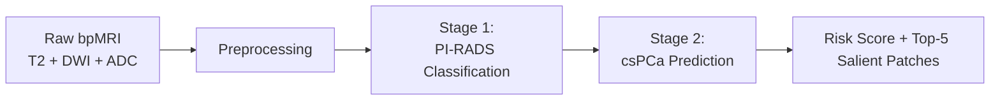

  

# WSAttention-Prostate

**Weakly Supervised Attention-Based Deep Learning for Prostate Cancer Characterization from Bi-Parametric Prostate MRI.**

WSAttention-Prostate is a two-stage deep learning pipeline that predicts clinically significant prostate cancer (csPCa) risk and PI-RADS score (2 to 5) from T2W, DWI, and ADC bpMRI sequences. The backbone is a patch based 3D Multiple-Instance Learning (MIL) model pre-trained to classify PI-RADS scores and fine-tuned to predict csPCa risk — all without requiring lesion-level annotations.

## Key Features

- **Weakly-supervised attention** — Heatmap-guided patch sampling and cosine-similarity attention loss replace the need for voxel-level labels
- **3D Multiple Instance Learning** — Extracts volumetric patches from MRI scans and aggregates them via transformer + attention pooling
- **Two-stage pipeline** — Stage 1 trains a 4-class PI-RADS classifier; Stage 2 freezes its backbone and trains a binary csPCa head
- **Preprocessing** — Preprocessing to minimize inter-center MRI acquisiton variability.
- **End-to-end pipeline** — Registration, segmentation, histogram matching, and heatmap generation, and inferencing in a single configurable pipeline

## Pipeline Overview

## Quick Links

- [Getting Started](getting-started.md) — Installation and first run
- [Pipeline](pipeline.md) — Full walkthrough of preprocessing, training, and evaluation
- [Architecture](architecture.md) — Model design and tensor shapes
- [Configuration](configuration.md) — YAML config reference
