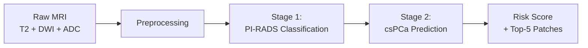

  

# WSAttention-Prostate

**Weakly-supervised attention-based 3D Multiple Instance Learning for prostate cancer risk prediction on multiparametric MRI.**

WSAttention-Prostate is a two-stage deep learning pipeline that predicts clinically significant prostate cancer (csPCa) risk from T2-weighted, DWI, and ADC MRI sequences. It uses 3D patch-based Multiple Instance Learning with transformer attention to first classify PI-RADS scores, then predict csPCa risk — all without requiring lesion-level annotations.

## Key Features

- **Weakly-supervised attention** — Heatmap-guided patch sampling and cosine-similarity attention loss replace the need for voxel-level labels
- **3D Multiple Instance Learning** — Extracts volumetric patches from MRI scans and aggregates them via transformer + attention pooling
- **Two-stage pipeline** — Stage 1 trains a 4-class PI-RADS classifier; Stage 2 freezes its backbone and trains a binary csPCa head
- **Multi-seed confidence intervals** — Runs 20 random seeds and reports 95% CI on AUC, sensitivity, and specificity
- **End-to-end preprocessing** — Registration, segmentation, histogram matching, and heatmap generation in a single configurable pipeline

## Pipeline Overview

## Quick Links

- [Getting Started](getting-started.md) — Installation and first run
- [Pipeline](pipeline.md) — Full walkthrough of preprocessing, training, and evaluation
- [Architecture](architecture.md) — Model design and tensor shapes
- [Configuration](configuration.md) — YAML config reference
