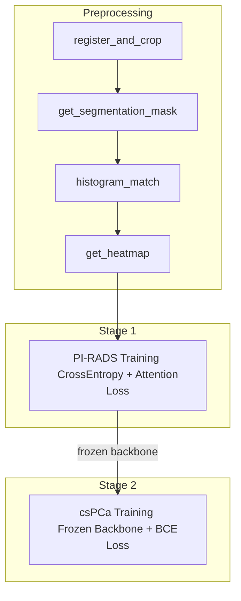

# Pipeline

The full pipeline has three phases: preprocessing, PI-RADS training (Stage 1), and csPCa training (Stage 2).



## Preprocessing
```bash
python preprocess_main.py \
    --config config/config_preprocess.yaml \
    --steps register_and_crop get_segmentation_mask histogram_match get_heatmap
```

Run the following steps in sequnce:

### Step 1: Register and Crop

Resamples T2W, DWI, and ADC to a common spacing of `(0.4, 0.4, 3.0)` mm using `picai_prep`, then center-crops with a configurable margin (default 20%).

### Step 2: Prostate Segmentation

Runs a pre-trained segmentation model on T2W images to generate binary prostate masks. Post-processing retains only the top 10 slices by non-zero voxel count.

### Step 3: Histogram Matching

Matches the histogram intensity of each sequnce to a reference image within masked (prostate) regions using `skimage.exposure.match_histograms`.

### Step 4: Heatmap Generation

Creates weak-attention heatmaps from DWI and ADC:

- **DWI heatmap**: `(dwi - min) / (max - min)` — higher DWI signal = higher attention
- **ADC heatmap**: `(max - adc) / (max - min)` — lower ADC = higher attention (inverted)
- **Combined**: element-wise product, re-normalized to [0, 1]

!!! note "Step Dependencies"
    Steps must run in the order shown above. The pipeline validates dependencies automatically — for example, `get_heatmap` requires `get_segmentation_mask` and `histogram_match` to have run first.

## Stage 1: PI-RADS Classification

Trains a 4-class PI-RADS classifier (grades 2–5, mapped to labels 0–3).

```bash
python run_pirads.py --mode train --config config/config_pirads_train.yaml
```

**Training details:**

| Component | Value |
|-----------|-------|
| Loss | CrossEntropy + cosine-similarity attention loss |
| Attention loss weight | Linear warmup over 25 epochs to `lambda=2.0` |
| Optimizer | AdamW (base LR `3e-5`, transformer LR `6e-5`) |
| Scheduler | CosineAnnealingLR |
| Metric | Quadratic Weighted Kappa (QWK) |
| Early stopping | After 40 epochs without validation loss improvement |
| AMP | Disabled by default (enabled in example YAML config) |

**Attention loss**: For each batch, the model's learned attention weights are compared against heatmap-derived attention labels via cosine similarity. PI-RADS 2 samples receive uniform attention (no lesion expected). The loss is weighted by `lambda_att`, which warms up linearly over the first 25 epochs.

## Stage 2: csPCa Risk Prediction

Builds on a frozen PI-RADS backbone to predict binary csPCa risk.

```bash
python run_cspca.py --mode train --config config/config_cspca_train.yaml
```

**Training details:**

| Component | Value |
|-----------|-------|
| Loss | Binary Cross-Entropy (BCE) |
| Backbone | Frozen PI-RADS model (ResNet18 + Transformer); attention module is trainable |
| Head | SimpleNN: `512 → 256 → 128 → 1` with ReLU + Dropout(0.3) + Sigmoid |
| Optimizer | AdamW (LR `2e-4`) |
| Seeds | 20 random seeds (default) for 95% CI |
| Metrics | AUC, Sensitivity, Specificity |

The backbone's feature extractor (`net`), transformer, and `myfc` are frozen. The attention module and `SimpleNN` classification head are trained. After training across all seeds, the framework reports mean and 95% confidence intervals for AUC, sensitivity, and specificity.
